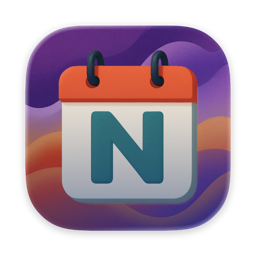

  
  <h1>NeverMiss</h1>

NeverMiss is an open-source macOS menu bar app that makes sure you never miss another meeting. It syncs your calendars, shows what's coming up in a full screen alert, and gets you there with one click.

  

## Why NeverMiss?

It's easy to miss tiny notifications when you're focused. NeverMiss fixes this with alerts you actually notice: full-screen countdowns, smart snoozing, and one-click meeting joins. It lives in your menu bar to stay out of your way until it matters.

## Install

1. **[Download the app](https://ko-fi.com/s/711502489b)** (DMG)
2. Drag NeverMiss to your Applications folder
3. Launch it — the onboarding wizard walks you through connecting your calendars

## Screenshots

## Features

- Full screen alerts
- Join meetings with one click (auto detect links from Google Meet, Zoom, Teams, and more).
- Smart snooze button
- Connect your calendars (Google Calendar + Calendar App)
- Menubar app
- Keyboard shortcuts
- Customize your alerts

---

## Privacy Policy

NeverMiss requests read-only access to your calendars and all your data stays local to your computer.
See the full privacy policy here: https://nevermiss.dev/privacy

## License

NeverMiss is licensed under the [GNU Affero General Public License v3.0 (AGPL-3.0)](LICENSE).

You're free to use, modify, and distribute this software. If you distribute a modified version, you must make your source code available under the same license. See the [LICENSE](LICENSE) file for the full text.

## Contributing

Contributions are welcome! Feel free to report a bug in the issues tab or open a PR.
